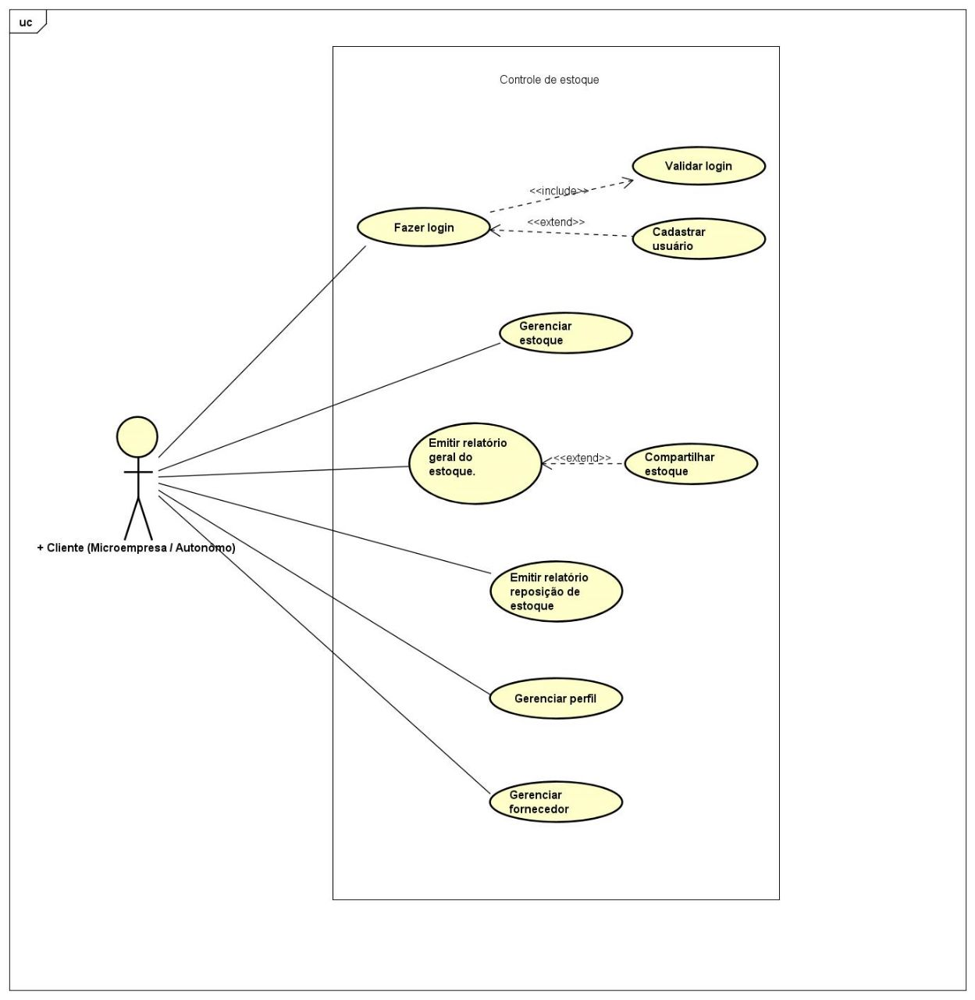

# Especificações do Projeto

Apresente uma visão geral do que será abordado nesta parte do documento, enumerando as técnicas e/ou ferramentas utilizadas para realizar a especificações do projeto

## Personas

|Irene Rodrigues|  |
|-----------------------|-|
|Idade:|61|
|Ocupação:| Empreendedora Mary Kay |
|Aplicativos:| Instagram, Whatsapp|
|Motivações | Sempre foi apaixonada por produtos de beleza e gosta de transformar o bem estar das pessoas atraves do conhecimento de seus produtos|
|Frustrações | Tem dificuldade em lembrar tudo que está em estoque |
|Ferramentas que usa na gestão | Anotações em um caderninho |

|Deidison Tadeu|  |
|-----------------------|-|
|Idade:|33|
|Ocupação:| Microempresario de Produtos de Limpeza |
|Aplicativos:| Whatsapp |
|Motivações | Após ficar desempregado, tive a oportunidade de revender produtos de limpeza e abracei|
|Frustrações | Por fazer o controle em notas e caderno, algumas informações acabam se perdendo ou se misturando|
|Ferramentas que usa na gestão | Anotações em um caderninho e acompanhamento com notas de fornecedores|

## Histórias de Usuários

Com base na análise das personas forma identificadas as seguintes histórias de usuários:

|EU COMO... `PERSONA`| QUERO/PRECISO ... `FUNCIONALIDADE` |PARA ... `MOTIVO/VALOR`                 |
|--------------------|------------------------------------|----------------------------------------|
|Usuário do sistema  | Registrar minhas tarefas           | Não esquecer de fazê-las               |
|Administrador       | Alterar permissões                 | Permitir que possam administrar contas |

Apresente aqui as histórias de usuário que são relevantes para o projeto de sua solução. As Histórias de Usuário consistem em uma ferramenta poderosa para a compreensão e elicitação dos requisitos funcionais e não funcionais da sua aplicação. Se possível, agrupe as histórias de usuário por contexto, para facilitar consultas recorrentes à essa parte do documento. 

## Requisitos

As tabelas que se seguem apresentam os requisitos funcionais e não funcionais que detalham o escopo do projeto.

### Requisitos Funcionais

|ID    | Descrição do Requisito  | Prioridade |
|------|-----------------------------------------|----|
|RF-001| O site deve permitir ao usuário (microempresa/autonômo) dados do estoque e compartilhar-o | ALTA | 
|RF-002| O site deve permitir o cliente gerenciar o estoque ( cadastrar novo produto, alterar produto, remover produto)  | ALTA |
|RF-003| O sistema deve permitir o gerenciamento do perfil ( alterar dados do perfil )  | ALTA |
|RF-004| O site deve permitir o cliente gerenciar os dados do fornecedor  | MÉDIA |
|RF-005| O sistema deve permitir a emissão de um relatório geral do estoque  | MÉDIO |
|RF-006| O sistema deve permitir a emissão de um relatório reposição de estoque  | MÉDIA |
|RF-007| O sistema deve verificar login válido  | MÉDIA |

### Requisitos não Funcionais

|ID     | Descrição do Requisito  |Prioridade |
|-------|-------------------------|----|
|RNF-001| O site deve ser publicado em um ambiente acessível publicamente na Internet (Repl.it, GitHub Pages, Heroku) | MÉDIA | 
|RNF-002| O site deverá ser responsivo permitindo a visualização em um celular de forma adequada |  ALTA |
|RNF-003| O site deve ter bom nível de contraste entre os elementos da tela em conformidade  |  MÉDIA | 
|RNF-004| O site deve ser compatível com os principais navegadores do mercado (Google Chrome, Firefox, Microsoft Edge) |  ALTA | 

Com base nas Histórias de Usuário, enumere os requisitos da sua solução. Classifique esses requisitos em dois grupos:

- [Requisitos Funcionais
 (RF)](https://pt.wikipedia.org/wiki/Requisito_funcional):
 correspondem a uma funcionalidade que deve estar presente na
  plataforma (ex: cadastro de usuário).
- [Requisitos Não Funcionais
  (RNF)](https://pt.wikipedia.org/wiki/Requisito_n%C3%A3o_funcional):
  correspondem a uma característica técnica, seja de usabilidade,
  desempenho, confiabilidade, segurança ou outro (ex: suporte a
  dispositivos iOS e Android).
Lembre-se que cada requisito deve corresponder à uma e somente uma
característica alvo da sua solução. Além disso, certifique-se de que
todos os aspectos capturados nas Histórias de Usuário foram cobertos.

## Restrições

O projeto está restrito pelos itens apresentados na tabela a seguir.

|ID| Restrição                                             |
|--|-------------------------------------------------------|
|01| O projeto deverá ser entregue até o final do semestre |
|02| Não pode ser desenvolvido um módulo de backend        |

Enumere as restrições à sua solução. Lembre-se de que as restrições geralmente limitam a solução candidata.

> **Links Úteis**:
> - [O que são Requisitos Funcionais e Requisitos Não Funcionais?](https://codificar.com.br/requisitos-funcionais-nao-funcionais/)
> - [O que são requisitos funcionais e requisitos não funcionais?](https://analisederequisitos.com.br/requisitos-funcionais-e-requisitos-nao-funcionais-o-que-sao/)

## Diagrama de Casos de Uso

