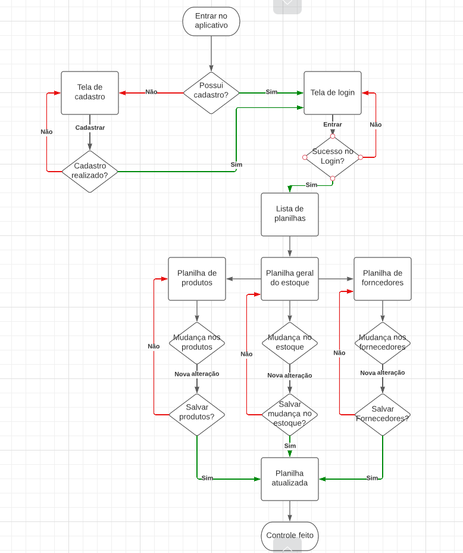

# Projeto de Interface

Pré-requisitos: <a href="2-Especificação do Projeto.md"> Documentação de Especificação</a>

Visão geral da interação do usuário pelas telas do sistema e protótipo interativo das telas com as funcionalidades que fazem parte do sistema (wireframes).

 Apresente as principais interfaces da plataforma. Discuta como ela foi elaborada de forma a atender os requisitos funcionais, não funcionais e histórias de usuário abordados nas <a href="2-Especificação do Projeto.md"> Documentação de Especificação</a>.

## Diagrama de Fluxo

https://lucid.app/lucidchart/f98b3bf3-d446-4e5b-a477-5f2347f277a5/edit?viewport_loc=-360%2C287%2C2773%2C1385%2CIb~J5odHI3Tb&invitationId=inv_6213b3af-2420-4da3-bd02-1c6d2a27b87d

## Wireframes

Confira aqui o [prótotipo do wireframe](https://www.figma.com/proto/eJulkCYNeOETMWS0uNjSJ2/Controle-de-estoque---Wireframe?node-id=1-790&scaling=scale-down&page-id=0%3A1&starting-point-node-id=1%3A790).
  
  Ferramenta utilizada:
  > - [Figma](https://www.figma.com/)

