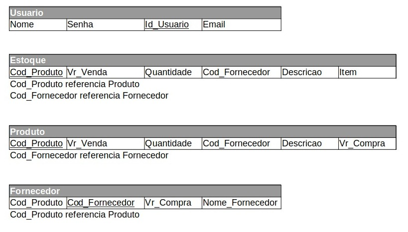
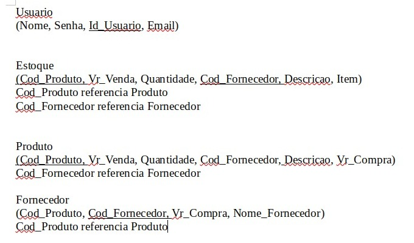

# Arquitetura da Solução

## Diagrama de Classes

https://lucid.app/lucidchart/7ae6f812-9413-473d-8192-f4cf7a00946b/edit?viewport_loc=-158%2C-55%2C2560%2C1278%2C0_0&invitationId=inv_36d95b9d-0834-4bf8-ae2c-3611f1d7bbed

## Modelo ER (Projeto Conceitual)

## Projeto da Base de Dados

||
|-----------------------|
|-----------------------|
||

## Tecnologias Utilizadas

Descreva aqui qual(is) tecnologias você vai usar para resolver o seu problema, ou seja, implementar a sua solução. Liste todas as tecnologias envolvidas, linguagens a serem utilizadas, serviços web, frameworks, bibliotecas, IDEs de desenvolvimento, e ferramentas.

Apresente também uma figura explicando como as tecnologias estão relacionadas ou como uma interação do usuário com o sistema vai ser conduzida, por onde ela passa até retornar uma resposta ao usuário.

## Hospedagem

Explique como a hospedagem e o lançamento da plataforma foi feita.

> **Links Úteis**:
>
> - [Website com GitHub Pages](https://pages.github.com/)
> - [Programação colaborativa com Repl.it](https://repl.it/)
> - [Getting Started with Heroku](https://devcenter.heroku.com/start)
> - [Publicando Seu Site No Heroku](http://pythonclub.com.br/publicando-seu-hello-world-no-heroku.html)
