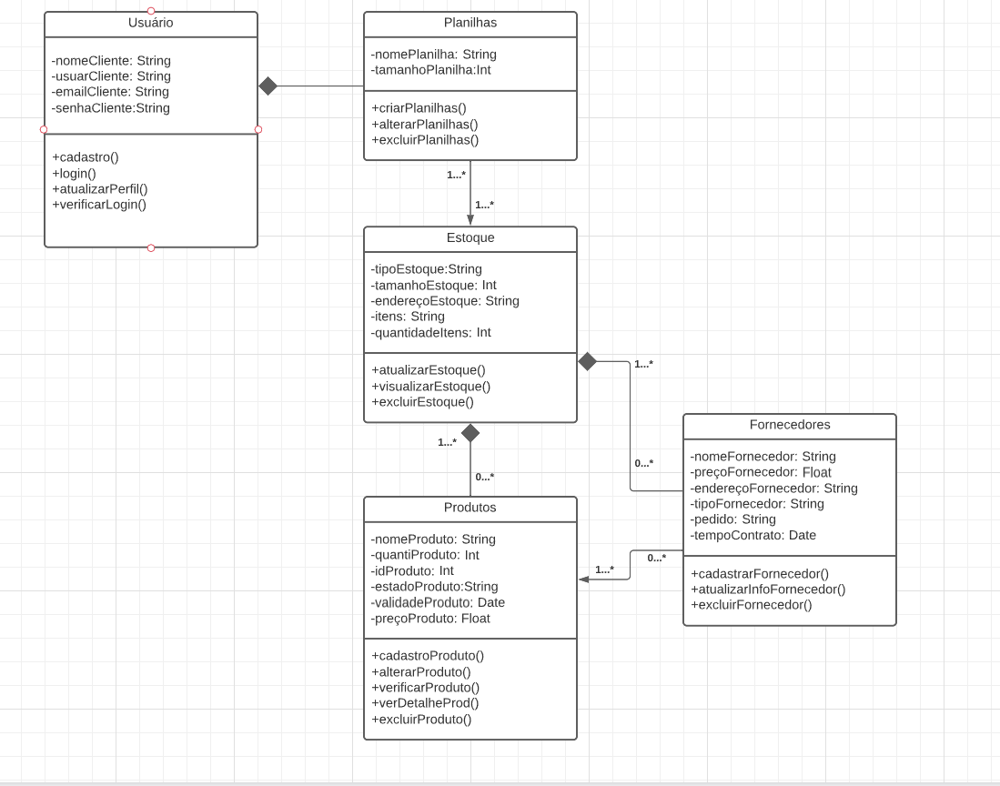
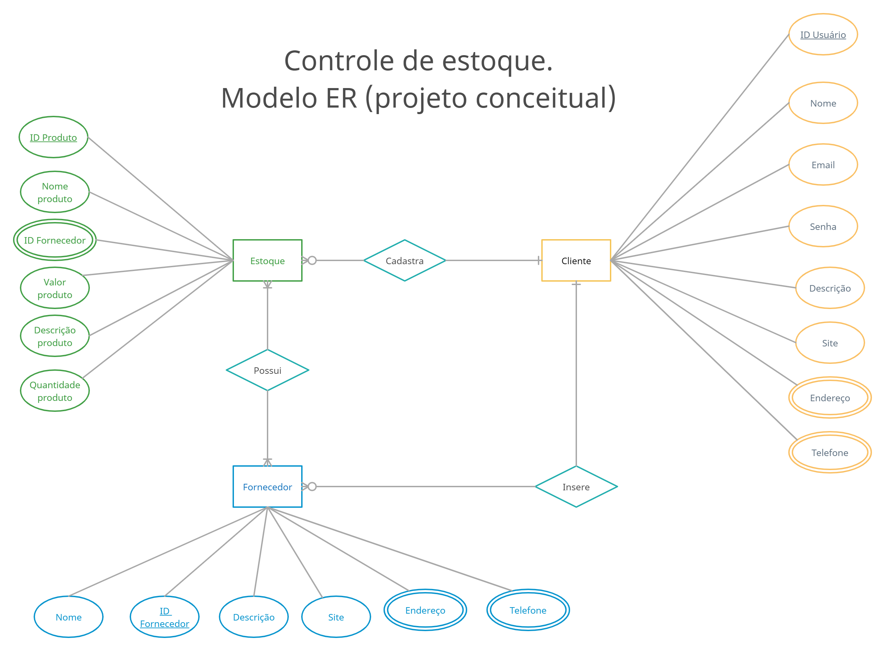
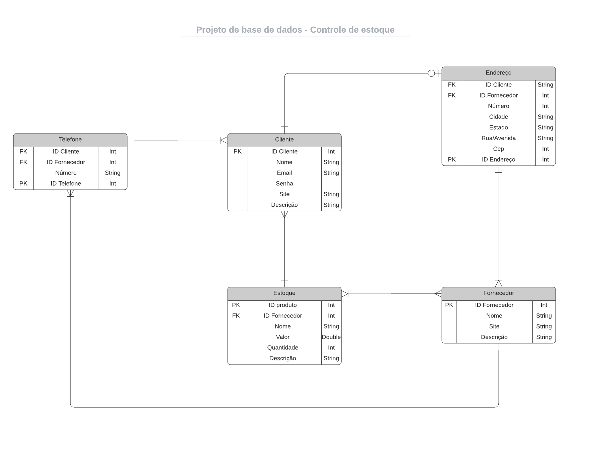

# Arquitetura da Solução

## Diagrama de Classes

## Modelo ER (Projeto Conceitual)

## Projeto da Base de Dados

## Tecnologias Utilizadas

Diagrama de Classe e base de dados desenvolvidos em: [Lucidchart](https://www.lucidchart.com/pages/)

Modelo conceitual do banco de dados desenvolvido em: [Creately](https://creately.com/pt/home/)

## Hospedagem

Explique como a hospedagem e o lançamento da plataforma foi feita.

> **Links Úteis**:
>
> - [Website com GitHub Pages](https://pages.github.com/)
> - [Programação colaborativa com Repl.it](https://repl.it/)
> - [Getting Started with Heroku](https://devcenter.heroku.com/start)
> - [Publicando Seu Site No Heroku](http://pythonclub.com.br/publicando-seu-hello-world-no-heroku.html)
